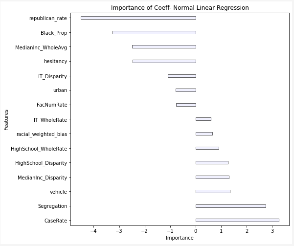

# IME692 Project
----
**`Objective:`** To examine the relationship between social determinants of health and racial disparities in covid-19 vaccination at the county level in US.

**`Data used from:`**  [https://doi.org/10.1073/pnas.2107873118](https://doi.org/10.1073/pnas.2107873118) -- `Original Paper 💭`

**`Members:`**
- [Sunil Dhaka](https://github.com/sunil-dhaka/)
- Arvind Singh Yadav

**`Results:`** 
---
Simple Linear Regression Model is better than its more complex adversaries, at least for our case. Although random forest does better than linear regression but it overfits the training dataset.
```
++++++++++++++++++++++++++++++++++++++++++++++++++
                   Model Name      Train       Test
0    Normal Linear Regression  56.266316  68.353944
1               Random Forest   8.045714  64.000379
2  Support Vector Resgression  61.927338  72.551176
++++++++++++++++++++++++++++++++++++++++++++++++++
```
---
For best selected model(normal linear regression) feature importance plot is given below


---
For detailed report [visit](final-report.ipynb) and for report pdf [visit](ime692a_project.pdf)
